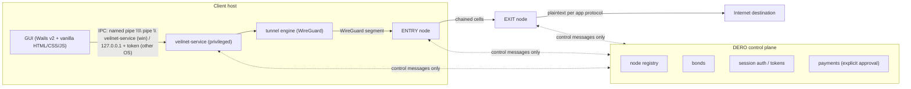
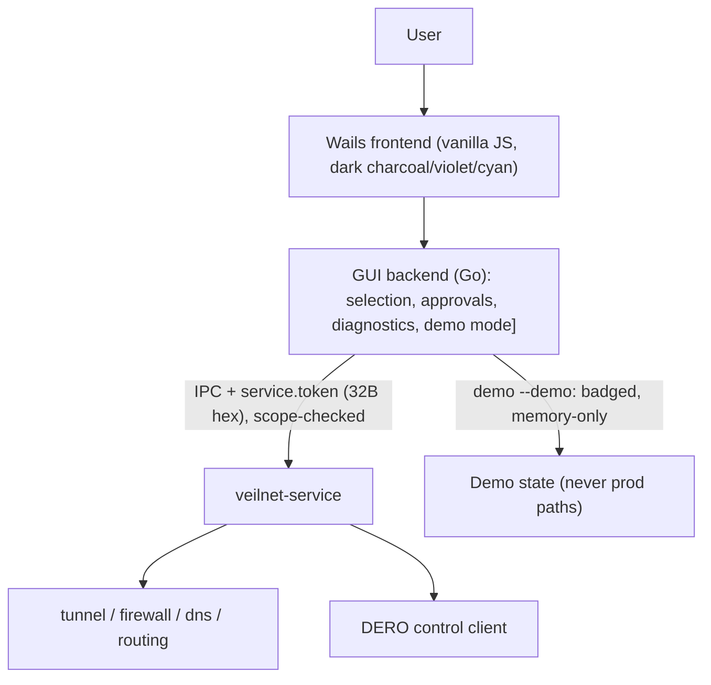

# VeilNet Architecture

## Control plane vs data plane (the one rule)

- **DERO control plane**: node registry + metadata, bonds, session
  authorization (256-bit base64url tokens, constant-time compare,
  single-use revocation), payments. Carries **control messages only**.
- **WireGuard data plane**: encrypted client→ENTRY segment plus the
  ENTRY→EXIT chain and EXIT→destination leg. Carries **all user traffic**.
  DERO never sees it; the data plane never writes to DERO.
- **Route construction vs enforcement**: `internal/multihop` builds and
  verifies segmented circuits (ENTRY+EXIT configs, rotation, latency
  scoring, disabled 3-hop stub); `internal/tunnel`, `routing`, `firewall`,
  `dns` (TunnelNetEngine) enforce them on the device. Multihop never
  imports the enforcers — handoff is plain HopConfig values mapping 1:1 to
  `tunnel.WireGuardConfig`.
- **Guards**: `internal/security` (auth, sanitizer, command allowlist,
  mgmt ACL + rate limits, log redactor, 7-check privacy diagnostics with
  WARNING states) sits beside every privileged call.

## Processes

| Binary | Role | Privilege |
|---|---|---|
| `veilnet-service` | owns tunnel device, firewall/kill-switch, DNS routing, IPC auth, DERO control calls | privileged (SYSTEM/root or CAP_NET_ADMIN) |
| `veilnet` | GUI backend + Wails frontend; status, selection, approvals, diagnostics display | user |
| `veilnet-node` | operator stack: session acceptance, token validation, forwarding | operator host |

## Service / GUI split

- The GUI backend never touches the WireGuard device or firewall
  directly; every privileged action goes through the service IPC and is
  re-validated there (token, scope, ACL, rate limit, command allowlist).
- Events flow service→GUI over `internal/events` bus
  (NODE_DISCOVERED/CONNECTED/DISCONNECTED, TUNNEL_STARTED/STOPPED,
  KILL_SWITCH_ENABLED, DNS_CHANGED, PAYMENT_REQUESTED/CONFIRMED,
  SESSION_AUTHORIZED/EXPIRED, NODE_HEARTBEAT, CIRCUIT_ROTATED,
  DERO_CONNECTED/DISCONNECTED, ERROR).
- Config: client `~/.veilnet/config.toml`, node
  `~/.veilnet-node/config.toml` (TOML via BurntSushi/toml); state in
  SQLite via modernc.org/sqlite. Demo mode (`veilnet --demo`) is clearly
  badged and isolated from prod state.

## Circuit lifecycle (2-hop default)

1. Select: latency aggregator ranks registry nodes
   (latency/load/price/uptime/local-history) → best distinct ENTRY+EXIT.
2. Build+Verify: `BuildTwoHop` → `Verify` → ENTRY WireGuard config +
   EXIT descriptor (public dial data only, no secrets).
3. Enforce: service programs tunnel, routes, firewall kill-switch, DNS.
4. Serve: session tokens authorize; rotation swaps ENTRY (EXIT kept) and
   publishes CIRCUIT_ROTATED; <2 usable nodes → badged single-hop
   fallback. 3-hop requests return ErrThreeHopDisabled (never faked).
